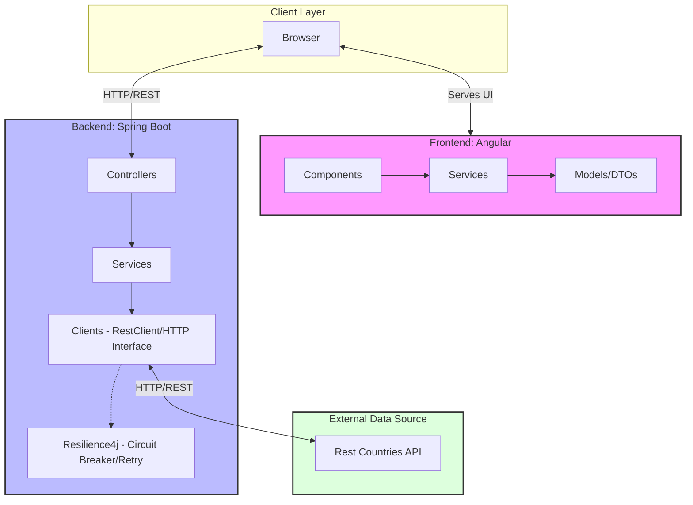

# Old Mutual Code Challenge Monorepo

This repository contains both the backend and frontend for the Old Mutual Code Challenge.

## Architecture Overview



## Project Structure
- `backend/`: Spring Boot application (Java 17, Gradle)
- `frontend/`: Angular application (Node.js 20, Angular 21)

## Prerequisites
- **Java 17** or higher
- **Node.js 20** or higher
- **NPM** (usually comes with Node.js)

## Getting Started

### Backend
To run the backend application:
```bash
cd backend
./gradlew bootRun
```
The backend will be available at `http://localhost:8080`.

### Frontend
To run the frontend application:
```bash
cd frontend
npm install
npm start
```
The frontend will be available at `http://localhost:4200`.

## Running Tests

### Backend Tests
```bash
cd backend
./gradlew test
```

### Frontend Tests
```bash
cd frontend
npm test
```

## CI/CD
The project uses GitHub Actions for continuous integration. The configuration can be found in `.github/workflows/ci-cd.yml`.
