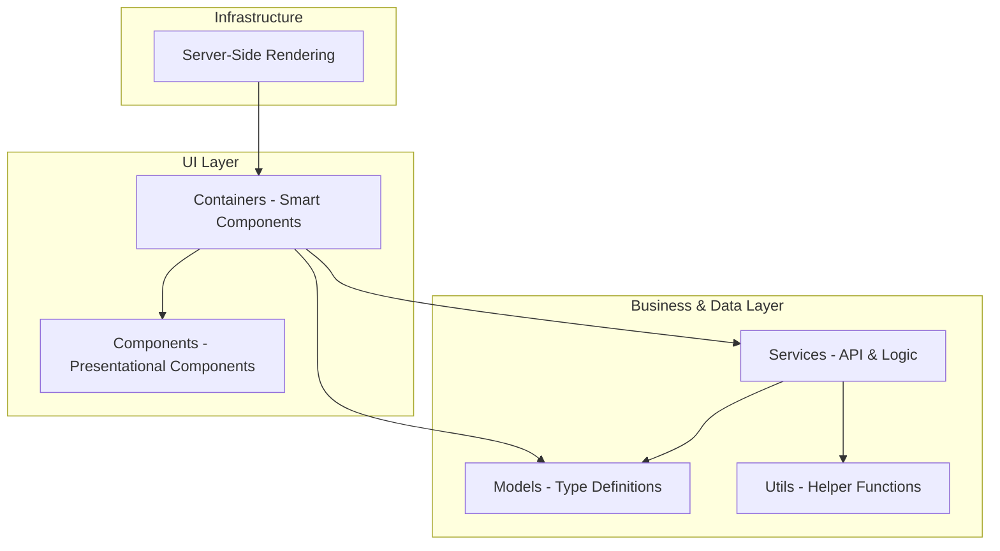

# Old Mutual Code Challenge - Frontend

This is the frontend application for the Old Mutual Code Challenge. It is built using **Angular 21** and provides a user interface to browse and view details about countries.

## 🛠️ Tools & Technologies

- **Framework**: [Angular 21](https://angular.dev/)
- **Styling**: [Tailwind CSS 4](https://tailwindcss.com/)
- **Testing**: [Vitest](https://vitest.dev/)
- **Rendering**: Server-Side Rendering (SSR) enabled
- **Configuration**: Environment-specific settings for API base URL
- **Package Manager**: npm

## ✨ Features

- **Country Browsing**: View a list of countries with essential information.
- **Detailed View**: Access detailed information for each country.
- **Filtering**: Search countries by name and filter by region.
- **Sorting**: Sort countries by various attributes (name, population, etc.).
- **Pagination**: Efficiently browse through the country list with paginated results.
- **Error Handling**: Graceful handling of API errors with user-friendly messages and states, including specific handling for 404, 502, 503, and 504 errors.
- **Responsive Design**: Fully responsive UI built with Tailwind CSS.
- **Accessibility**: Semantic HTML and accessible components.

## 🏗️ Architecture Layout

The project follows a modular and component-based architecture:



- **Containers (`src/app/containers`)**: Smart components that handle data fetching and state management.
  - `home`: Displays the list of all countries with pagination, filtering, and sorting.
  - `detail`: Displays detailed information about a specific country.
  - `not-found`: Custom 404 error page.
- **Components (`src/app/components`)**: Presentational (dumb) components focused on UI rendering.
  - `country-card`: Reusable card component for displaying country summaries.
- **Services (`src/app/services`)**: Business logic and API communication.
  - `CountriesService`: Fetches country data from the backend.
  - `GenericHttpService`: A wrapper for standard HTTP operations.
- **Models (`src/app/models`)**: TypeScript interfaces defining data structures.
- **Utils (`src/app/utils`)**: Utility functions and helpers (e.g., error mapping).
- **SSR**: Configured for Server-Side Rendering to improve SEO and initial load performance.

## 📂 Project Structure

```text
src/
├── app/
│   ├── components/       # Reusable UI components
│   ├── containers/       # Page-level components (Smart components)
│   ├── models/           # TypeScript interfaces
│   ├── services/         # API services and business logic
│   ├── utils/            # Utility functions (Error mapping, etc.)
│   ├── app.config.ts     # Main application configuration
│   ├── app.routes.ts     # Routing definitions
│   └── app.ts            # Root component
├── environments/         # Environment-specific configurations
├── main.ts               # Application entry point
├── styles.css            # Global styles (Tailwind imports)
└── server.ts             # SSR server configuration
```

## 🚀 Getting Started

### Prerequisites

- Node.js (version recommended in `package.json` engine or latest LTS)
- npm

### Installation

```bash
npm install
```

### Development Server

Run the development server:

```bash
npm start
```

Navigate to `http://localhost:4200/`. The application will automatically reload if you change any of the source files.

### Build

Run the following command to build the project. The build artifacts will be stored in the `dist/` directory.

```bash
npm run build
```

### Running Tests

Execute the unit tests using Vitest:

```bash
npm test
```

### Environment Configuration

The application uses Angular's environment-specific configuration files located in `src/environments/`.
- `environment.ts`: Used for development.
- `environment.prod.ts`: Used for production builds.

To update the API base URL, modify the `apiBaseUrl` property in the respective environment file.

## 🎨 Styling

The project uses Tailwind CSS 4 for utility-first styling. Configuration can be found in `package.json` and CSS imports are in `src/styles.css`.

## 🧪 Testing Strategy

Unit tests are written using Vitest, providing a fast and modern testing experience. Test files follow the `.spec.ts` naming convention and are located alongside the files they test.
    
## 🛡️ Error Handling & Systems Thinking

The application implements a robust error handling strategy to ensure backend error semantics are clearly surfaced to the user.

### End-to-End Error Flow

1.  **Backend Response**: The backend API returns an error response (e.g., 404 Not Found, 503 Service Unavailable).
2.  **HTTP Interception/Handling**: The `CountriesService` (via `GenericHttpService`) receives the `HttpErrorResponse`.
3.  **Error Mapping**: The `mapHttpError` utility (`src/app/utils/error-mapper.ts`) processes the error:
    - **404**: Mapped to "The requested resource was not found (404)."
    - **502**: Mapped to "Bad Gateway (502). The server received an invalid response from the upstream server."
    - **503**: Mapped to "Service Unavailable (503). The server is currently unable to handle the request."
    - **504**: Mapped to "Gateway Timeout (504). The server did not receive a timely response from the upstream server."
    - **0 (Connection Error)**: Mapped to "Cannot connect to the server. Please check your internet connection."
    - **Generic/Other**: Mapped to a general error message including the status code.
4.  **UI State Update**: The container components (`HomeComponent`, `DetailComponent`) update their `uiState` signal with the mapped message and status code.
5.  **User Notification**: The UI reactively displays the error message in a user-friendly manner (e.g., red error text in the content area).

### Error Semantics

- **Client-Side Errors (4xx)**: Indicate issues with the request or missing resources. The UI suggests that the resource might not exist.
- **Server-Side Errors (5xx)**: Indicate issues with the backend or its upstream services. The UI informs the user about service availability or gateway issues, suggesting a later retry.
- **Network Errors (0)**: Specifically handled to distinguish between a functioning backend and connectivity issues.
